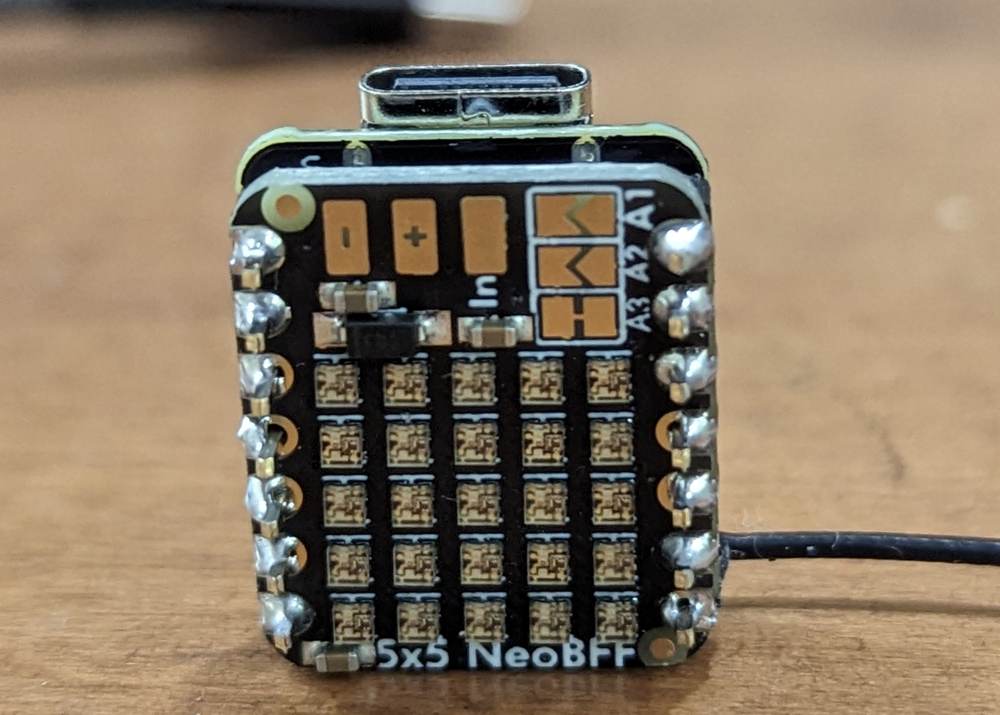

# Glowing Pumpkin Xiao 5x5 BFF

Years ago I published a several Glowing Pumpkin projects: [Arduino Glowing Pumpkin](https://github.com/johnwargo/glowing-pumpkin-trinket-neopixel) and [Arduino Glowing Pumpkin (Adafruit Feather)](https://github.com/johnwargo/glowing-pumpkin-feather). Each of these projects. Both of them used Arduino compatible devices plus either one of the Adafruit multi-NeoPixel devices or a NeoPixel shield.  

The shield approach was easy because I just had to solder some male and female headers to the boards and press them together into a unit. My first project used the NeoPixel Ring which required soldering wires and running them into an enclosure where the Arduino device resides. 

I always wanted to redo this project, especially using some of the smaller ESP32 devices like the [Seeed Studio Xaio](https://www.seeedstudio.com/xiao-series-page) series of microcontrollers. A while back I was perusing the Adafruit site looking for new products when I noticed the [Adafruit 5x5 NeoPixel Grid BFF Add-On for QT Py and Xiao](https://www.adafruit.com/product/5646); it's a super tiny device, designed to attach back to back with a Seeed Xiao board. This combination gives me an opportunity to do a super small reboot of the glowing pumpkin here.

Here's the project in action

[](https://youtu.be/05cMcB_vGCM)

## Parts

For this project, I used:

* [Seeed Studio XIAO ESP32S3](https://www.seeedstudio.com/XIAO-ESP32S3-p-5627.html)
* [Adafruit 5x5 NeoPixel Grid BFF Add-On for QT Py and Xiao](https://www.adafruit.com/product/5646)

You should be able to use any of the Xiao boards, but I didn't test on anything but the one listed above; so the pinouts may vary.

The Adafruit 5x5 board comes pre-configured to connect to pin A3 on the Xiao, but supports other options as well. Refer to the Adafruit documentation for details.

## Assembly

Assembling the device is super easy, you can solder the device back to back (which is pretty cool) or you can use headers to connect them together. I used male headers to connect the two boards together as shown in the following figure.


It took me a while to figure out how to orient the two devices when connecting them together. When you put them together back to back, with the USB connector for the Xiao board pointing up, the 5x5 board should be facing up as well, with the text at the bottom and the power pads (`+` and `-` pads) at the top as shown in the following figure.




## The Code

The code is pretty straight forward and installs like any other Arduino sketch. I'm not going to explain that here. 

The first thing the sketch does is define options for the LEDs. This sketch uses the [FastLED](https://fastled.io/) library instead of the standard NeoPixel libraries. I did this because FastLED is more flexible in several ways when working with NeoPixels. I didn't use any of those features in this project, but it's standard operating procedure for me to use FastLED.

At the top of the code are two variables that define the array of colors the device uses and the number of colors in the array. If you want to add or remove colors from the array, just make sure to change the number assigned to `numColors` when you do.

```c
int numColors = 6;
uint32_t colors[] = { CRGB::Blue, CRGB::Green, CRGB::Orange, CRGB::Purple, CRGB::Red, CRGB::Yellow };
CRGB leds[NUM_LEDS];  // LED Array (internal memory structure from FastLED)
```

The `leds` variable defines the internal memory structure FastLED uses to manage the NeoPixels.

In the `setup` function, the code simply initializes the FastLED library then flashes all the NeoPixels red a few times:

```c
void setup() {
  // Initialize the FastLED library
  FastLED.addLeds<NEOPIXEL, PIN>(leds, NUM_LEDS);
  delay(500);
  // Flash the lights RED twice
  flashLEDs(CRGB::Red, 2, 250);
}
```

Here's the code that flashes the LEDs:

```c
void flashLEDs(CRGB color, int count, int duration) {
  // Calculate this only once, no reason to calculate this in the loop
  int offDuration = duration / 2;

  for (int i = 0; i < count; i++) {
    fill_solid(leds, NUM_LEDS, CRGB::Red);
    FastLED.show();
    delay(duration);
    fill_solid(leds, NUM_LEDS, CRGB::Black);
    FastLED.show();
    delay(offDuration);
  }
}
```

Finally, in the `loop` function, the code generates a random number between 1 and 10; if the random value is 8 or 9, the code calls a function to flash the LEDs white for a random number of times. This simulates lightning or sparks inside the pumpkin hosting the device.

If the random number is between 0 and 8 (1 through 7), then it:

1. Selects a random color from the array.
2. Switches all LEDs to that color.
3. Waits a random amount of time.

Here's the decision loop that decides whether to flash or change colors:

```c
void loop() {
  //generate a random integer between 1 and 10
  if ((int)random(11) > 8) {
    // if it's a 9 or a 10, do that flicker thing
    flicker();
  } else {
    // Otherwise switch to the new color
    fadeColor(colors[(int)random(1, numColors + 1)]);
  }
}
```

Here's the code that flashes the LEDs:

```c
void flicker() {
  // how many times are we going to flash?
  int flashCount = (int)random(1, 6);
  //flash the lights in white flashCount times
  //with a random duration and random delay between each flash
  for (int i = 0; i < flashCount; i++) {
    // Set all pixels to white and turn them on    
    fill_solid(leds, NUM_LEDS, CRGB::White);
    FastLED.show();
    // Delay for a random period of time (in milliseconds)
    delay((int)random(50, 150));
    //clear the lights (set the color to none)    
    fill_solid(leds, NUM_LEDS, CRGB::Black);
    FastLED.show();
    // Delay for a random period of time (in milliseconds)
    delay((int)random(100, 500));
  }
}
```

and, finally, here's the code that switches the color:

```c
// Fill the NeoPixel array with a specific color
void fadeColor(CRGB c) {
  for (int i = 0; i <= 25; i++) {
    leds[i] = c;
    FastLED.show();
    delay(10);
  }
  delay((int)random(250, 2000));
}
```

The biggest difference here is in how I switch colors. In the older projects, I tried to deliver a smooth transition between colors by switching colors pixel by pixel. For this version I do the same thing only faster, so the animation looks very smooth and the color switch happens not immediately but fast enough that it feels like a smooth transition.

***

You can find information on many different topics on my [personal blog](http://www.johnwargo.com). Learn about all of my publications at [John Wargo Books](http://www.johnwargobooks.com).

If you find this code useful and feel like thanking me for providing it, please consider <a href="https://www.buymeacoffee.com/johnwargo" target="_blank">Buying Me a Coffee</a>, or making a purchase from [my Amazon Wish List](https://amzn.com/w/1WI6AAUKPT5P9).


